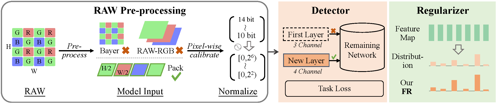
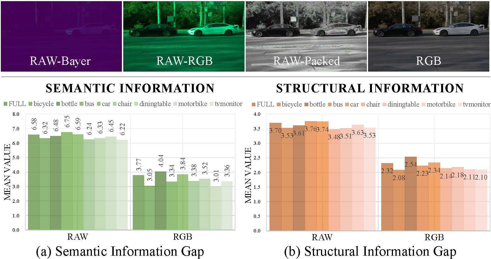

# RAW Mining
This repository contains the implementation of the paper *Guiding a Harsh-Environments Robust Detector via
RAW Data Characteristic Mining*.

***

|Information Gap|Functional Regularization|
|---------------|-------------------------|
|||
***

## Pipeline of RAW Detection (***PRD***)
>*PRD* fundamentally distinguishes itself from demosaicing or other two-stage structures. *PRD* does not involve the generation or reconstruction of a complete RGB image. Its primary objective is to facilitate detection by making adaptive adjustments to RAW images, without imposing additional burden.

<strong>Implementation Details</strong> (click to expand) 

- The choice of normalization range is based on the data bit depth. We aim to enhance the model's discriminative power for RAW data. For example, RGB images (8-bit) are typically normalized to the range [0, 1). However, when we encounter 14-bit RAW images, representing such rich information within the [0, 1) range is no longer appropriate. We use the 8-bit normalization range as a benchmark and gradually expand the processing range for data during preprocessing up to $2^{(14-8=6)}$. Experimental results demonstrate that this choice aligns well with our expectations. 

- After adjusting the normalization range, the values are represented as float32, which directly serves as the input. Thirdly, *PRD* initializes the layers in the backbone, except for the first layer, by default using a Pre-trained model.

- The normalization parameters for input data need to be precisely adjusted. During the training phase for RAW detection, the normalization parameters are calculated based on the mean and variance of the RAW dataset, such as LOD. Changing the normalization range does not alter the intrinsic information of the data. The purpose of adjusting the normalization range is to enable the model to handle pixel-level subtle variations and details more sensitively. This adaptation allows the model to accommodate the unique properties of RAW data better.

<strong>Configs and Checkpoints</strong> (click to expand) 

Configuration files and model checkpoints are provided. Here is a summary table for easy navigation:
<table>
  <tr>
    <th align="left">Model</th>
    <th align="center">Data Type</th>
    <th align="center">Config</th>
    <th align="center">Checkpoint</th>
  </tr>
  <tr>
    <td align="left">DETR</td>
    <td align="center">RAW</td>
    <td align="center">[<a href="configs/detr_pretrain_raw.py">File</a>]</td>
    <td align="center"><a href="https://drive.google.com/drive/folders/">Model</a></td>
  </tr>
   <tr>
    <td align="left">DETR</td>
    <td align="center">RGB</td>
    <td align="center">[<a href="configs/detr_pretrain_rgb.py">File</a>]</td>
    <td align="center"><a href="https://drive.google.com/drive/folders/">Model</a></td>
  </tr>
    <tr>
    <td align="left">DETR</td>
    <td align="center">RAW-snow</td>
    <td align="center">[<a href="configs/detr_pretrain_raw_snow.py">File</a>]</td>
    <td align="center"><a href="https://drive.google.com/drive/folders/">Model</a></td>
  </tr>
   <tr>
    <td align="left">DETR</td>
    <td align="center">RGB-snow</td>
    <td align="center">[<a href="configs/detr_pretrain_rgb_snow.py">File</a>]</td>
    <td align="center"><a href="https://drive.google.com/drive/folders/">Model</a></td>
  </tr>
    <tr>
    <td align="left">DETR</td>
    <td align="center">RAW-frost</td>
    <td align="center">[<a href="configs/detr_pretrain_raw_frost.py">File</a>]</td>
    <td align="center"><a href="https://drive.google.com/drive/folders/">Model</a></td>
  </tr>
   <tr>
    <td align="left">DETR</td>
    <td align="center">RGB-frost</td>
    <td align="center">[<a href="configs/detr_pretrain_rgb_frost.py">File</a>]</td>
    <td align="center"><a href="https://drive.google.com/drive/folders/">Model</a></td>
  </tr>
    <tr>
    <td align="left">DETR</td>
    <td align="center">RAW-fog</td>
    <td align="center">[<a href="configs/detr_pretrain_raw_fog.py">File</a>]</td>
    <td align="center"><a href="https://drive.google.com/drive/folders/">Model</a></td>
  </tr>
   <tr>
    <td align="left">DETR</td>
    <td align="center">RGB-fog</td>
    <td align="center">[<a href="configs/detr_pretrain_rgb_fog.py">File</a>]</td>
    <td align="center"><a href="https://drive.google.com/drive/folders/">Model</a></td>
  </tr>
  </tr>
    <tr>
    <td align="left">DETR</td>
    <td align="center">RAW-defocus blur</td>
    <td align="center">[<a href="configs/detr_pretrain_raw_defocus.py">File</a>]</td>
    <td align="center"><a href="https://drive.google.com/drive/folders/">Model</a></td>
  </tr>
   <tr>
    <td align="left">DETR</td>
    <td align="center">RGB-defocus blur</td>
    <td align="center">[<a href="configs/detr_pretrain_rgb_defocus.py">File</a>]</td>
    <td align="center"><a href="https://drive.google.com/drive/folders/">Model</a></td>
  </tr>
  </table>

## RAW Corruption Benchmark (***RCB***)
>Fine-tuning a model on a specific type of corruption does not necessarily improve its performance on other forms of perturbation or corrosion. Fine-tuning on multiple types of corruption may lead to decreased performance.

<strong>Implementation Details</strong> (click to expand) 

Taking into account the adverse scenarios of RGB in real-world and the general experimental interference, we developed eight corrupt scenarios in RCB, including two categories: blur and weather. The reason for excluding other common interferences is to prevent the reconstructed distorted RAW images from deviating from the true data distribution.

To further analyze detector robustness, we experimented with RGB and RAW detection under conditions of lighting changes and occlusions using albumentations and cutout, detailed in Table *a*. Results show RGB detection decreases more than RAW detection when lighting conditions are altered.

## Functional Regularization (***FR***)

<strong>Implementation Details</strong> (click to expand) 

We conduct an in-depth investigation into the optimal placement of *FR* to further enhance performance improvements. Notably, even when researchers employ novel activation functions, such as in MobileNet v3, the middle layer of the network continues to utilize the ReLU function, with H-Swish being employed solely at the beginning or end.

<strong>Ablation Study</strong> (click to expand) 

*In which part of the network (backbone, neck, head, or specific layers) should the activation function replacement occur?* As shown in Table *b*, we have made the following observations: (1) Neither ReLU6 nor H-Swish outperforms ReLU in the head. (2) The appropriate component positions for ReLU6 and H-Swish differ. (3) Achieving optimal results involves replacing the activation function with our *FR* in the initial layers of both the backbone and neck. This is the final decision we have made regarding the replacement with *FR*.

## Other Ablation Results
**Domain Shift**: Our investigations into the inference capabilities of normally trained detectors across varied environmental conditions revealed a significant performance degradation in RGB detection, in stark contrast to RAW detection which demonstrated relative resilience. Using FCOS, initial RAW and RGB performances are 44.0 and 44.4 mAP, respectively. In snowy conditions, RAW and RGB fell to 16.4 and 1.2 mAP; in frost, to 18.8 and 2.1 mAP; and in fog, to 28.4 and 20.1 mAP. 

## Visualization

## License and Acknowledgment
**License**: RAW Mining is released under the MIT License. See the [LICENSE](https://github.com/DreamerCCC/RawMining/blob/main/LICENSE) file for more details.

**Acknowledgment**: This work is based on the [OpenMMLab Detection Toolbox](https://github.com/open-mmlab/mmdetection) toolbox and [LODDataset](https://github.com/yanghong7410/LODDataset). 

## Citation
If you find it inspiring, please consider citing:

    @inproceedings{chen2024guiding,
        title={Guiding a Harsh-Environments Robust Detector via RAW Data Characteristic Mining},
        author={Chen, Hongyang and Tai, Hung-Shuo and Ma, Kaisheng},
        booktitle={Proceedings of the AAAI Conference on Artificial Intelligence},
        volume={38},
        number={2},
        pages={1063--1071},
        year={2024}
    }
